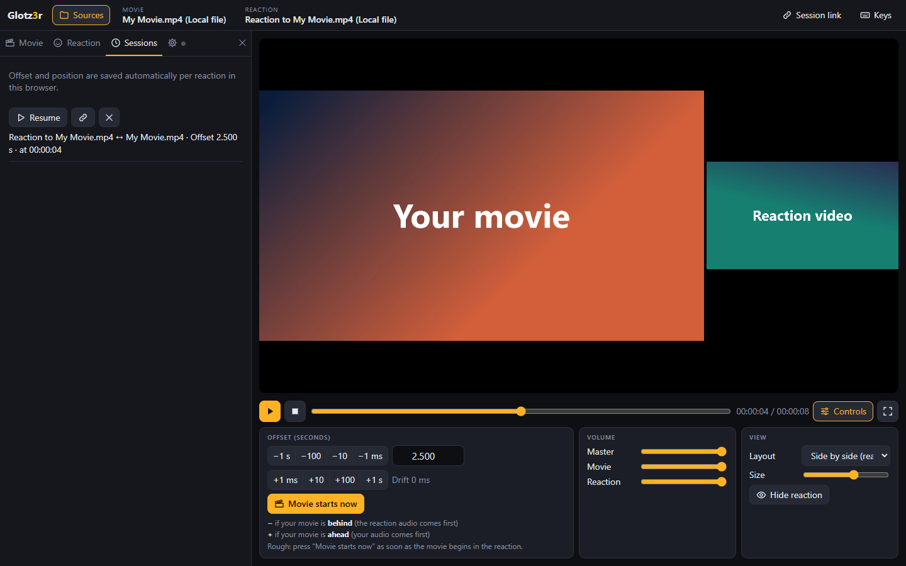

# Glotz3r

*Spectatorem spectantem specta* – watch the watcher watching.

Watch reaction videos in sync with your own movie or series. The reaction sets the pace, and the movie follows it with an adjustable, millisecond-accurate offset.



The whole application is a single web page ([index.html](index.html)). A small executable serves it locally and opens it in the browser.

## Build and run

### As an executable

You need [Go](https://go.dev/dl/). Build:

```bash
go build -ldflags "-s -w" -o glotz3r.exe .
```

Then start `glotz3r.exe` with a double click. The page opens in the browser at `http://127.0.0.1:8097`. Closing the console window stops Glotz3r.

`index.html` is embedded into the executable at build time, so rebuild after changing the page. If the old version is still running during the build, it is left behind as `glotz3r.exe~` and can be deleted once it is closed.

For other systems (Git Bash syntax; in PowerShell set `$env:CGO_ENABLED = "0"`, `$env:GOOS = "linux"` and `$env:GOARCH = "amd64"` first):

```bash
CGO_ENABLED=0 GOOS=linux GOARCH=amd64 go build -ldflags "-s -w" -o glotz3r .
```

```bash
CGO_ENABLED=0 GOOS=darwin GOARCH=arm64 go build -ldflags "-s -w" -o glotz3r .
```

Start options:

| Option | Effect |
|---|---|
| `-jellyfin https://…` | Presets the Jellyfin address; the address field in the page is hidden. The environment variable `JELLYFIN_URL` does the same. |
| `-port 1234` | Different port (default 8097, or the environment variable `PORT`). |
| `-no-browser` | Starts without opening the browser. |

### Without building, straight from source

```bash
go run .
```

## Usage

1. Open the **Sources** panel on the left and, if you use Jellyfin, sign in to Jellyfin on the settings tab (gear icon) with your password or Quick Connect.
2. Choose one source each on the **Movie** and **Reaction** tabs. The header shows what is loaded.
3. Play the reaction. As soon as the person in the video starts their movie, press **Movie starts now** (key `R`). This sets the offset.
4. Fine-tune the offset if needed: **−** if your movie is behind, **+** if it is ahead.

The browser remembers whether the panel is open, which tab is selected and whether the controls below the video are collapsed (**Controls** button).

### Sources

| Source | Movie | Reaction |
|---|---|---|
| Jellyfin (tree of libraries, series, seasons and episodes; or search by title, id or link to the details page) | yes | yes |
| YouTube link | no | yes |
| Local video file (file picker or drag & drop onto the video area) | yes | yes |

If the browser cannot play a Jellyfin file itself, the Jellyfin server transcodes it. “Current” then shows “transcoded by server”.

### Keys

| Key | Effect |
|---|---|
| Space | Play / pause |
| `,` `.` | Offset −/+ 10 ms |
| `-` `+` | Offset −/+ 100 ms |
| `R` | Movie starts now (reset offset) |
| `L` | Next layout |
| `V` | Hide / show the reaction picture, audio keeps playing |
| `F` | Fullscreen on / off |
| `H` or `?` | Keyboard shortcuts overview |

The keyboard's media keys (play/pause, stop) work as well.

### Sessions

Offset and position are saved automatically per reaction in the browser and applied the next time the same reaction is loaded. **Session link** copies a session as a link, for example for another device. The link contains the sources (Jellyfin ids plus the address of the Jellyfin server, YouTube video), offset and position, but no credentials. Whoever opens it signs in with their own Jellyfin account; the session then loads by itself. Local files cannot be linked – the link only carries the file name, and you have to pick the file yourself.

### Language

English and German, switchable on the settings tab (gear icon) of the sources panel; the default is the browser language. Another language only needs an entry in `LANGS` and a dictionary in `I18N` (both in `index.html`; the key is the English text). Missing translations are reported in the browser console.

## Install as an app (no need to start the server)

Glotz3r can be installed as an app (PWA). It then starts like a program of its own from the start menu, even when the `.exe` is not running:

1. Start the `.exe` once and open the page in Chrome or Edge.
2. In the sources panel under settings (gear icon) press **Install as app**, or use the install icon in the address bar.

The app runs at the same address (`http://127.0.0.1:8097`), so login and sessions are kept. The browser keeps the page cached. After changing `index.html`, start the `.exe` once and open the app; it then fetches the new version. Firefox cannot install apps, but after the first visit it also opens the page at that address without the server.

## Good to know

- **Storage:** Login, sessions and settings live in the browser and apply per address. `http://127.0.0.1:8097` and `http://localhost:8097` are two separate stores for the browser, and so is a different port.
- **YouTube** only works when the page is served via http/https, not when `index.html` is opened directly with a double click. Some videos do not allow embedding.
- **Pauses in the reaction video:** If the person in the video pauses their movie, the offset shifts and has to be readjusted by hand.

## Project layout

| File | Purpose |
|---|---|
| `index.html` | The entire application (HTML, CSS, JavaScript) |
| `sw.js`, `manifest.webmanifest` | Make the page installable as an app; `sw.js` keeps it in the browser cache |
| `screenshot.png` | Screenshot for this README |
| `main.go`, `go.mod` | Small local server that serves the embedded `index.html` |
| `.claude/launch.json` | Preview configuration for Claude Code |
